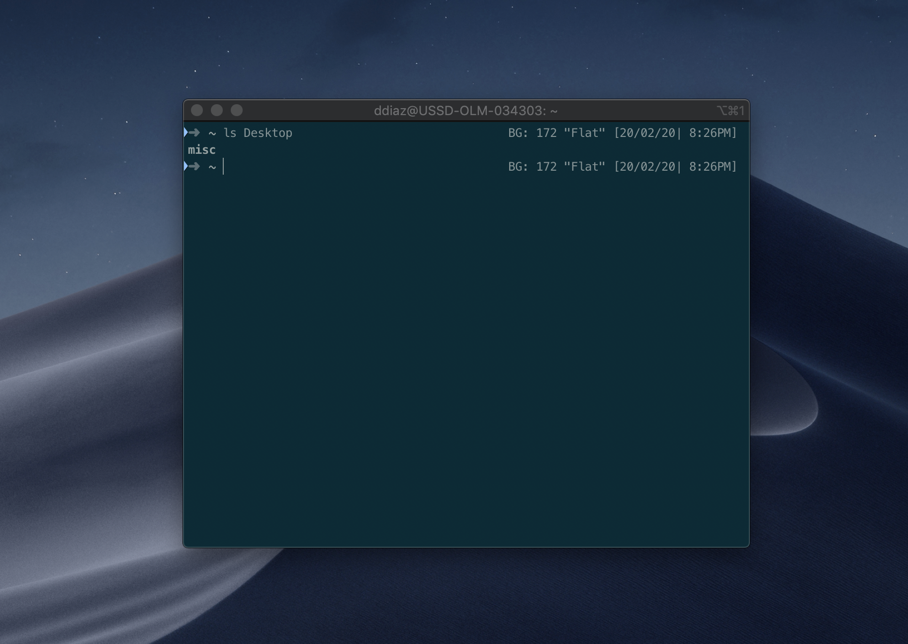

# Background
iTerm2 with oh-my-zsh is my goto environment for doing anything on the command line.
Recently they announced a feature called the status bar.
You can check out the feature [here](https://www.iterm2.com/documentation-status-bar.html).
It lets you display nifty information like current CPU/Network/Mem Utilization.
What is really cool though, is that you can take it a step further.
You can customize it to display your current kubernetes context or even your current AWS Profile.
This got me thinking, I wonder if I could display my current Blood Glucose inline on my terminal?

# Challenge Statement
So the question is, how can I display my current blood glucose on my terminal.

>#### Wait, Blood Glucose, what is that?
>Oh, good question. I have an autoimmune disorder called Type 1 Diabetes. 
>Long story short, my body attacks the insulin producing cells in my pancreas. 
>Insulin is what helps your body use the energy in the food you eat.
>Without it, instead of glucose going from your food into your cells, it stays in your blood stream.
>Having too much blood sugar in your blood can lead to serious complications. So managing diabetes becomes an
>endeavour in managing this blood glucose number, against several other factors, to stay healthy.

# First Attempt
I am running an open source website called [Nightscout](http://www.nightscout.info/) that scrapes my blood glucose data from a continuous glucose monitor that I wear on my body.
This site also exposes an endpoint I can GET to obtain my current blood glucose reading. So my first thought was, this should be simple.
All I need to do is curl that endpoint and then display that in my terminal.

# Not so FAST!
I immediately noticed that while this solution worked, it seriously slowed down the speed of my terminal.
What was happening was that every time I executed a command, my terminal would attempt to update my current glucose by curling the endpint.
This added about half a second of latency to my terminal. On the command line, this can feel way too slow.

# There has to be a better way...
And there is! I decided that what I could do instead is just have a cron job that runs on my mac, curls that endpoint every 3 mintues, and writes the result to a file.
Then from there, I could just output the text of that file in my terminal prompt! Now that is super fast! 

## What does it look like

On the right hand side, you will see the right prompt. 
> BG: "Glucose Number" "Trend" "Timestamp of Reading"

So according to the image above, I have a current blood glucose of 172, and I am trending flat. The trend is actually an
extremely cool part of wearing a dexcom continuous glucose monitor.

Instead of getting a snapshot of where your numbers are, which doesnt tell you anything about if they are going down or up,
the trend can give you an indication on where you are going. This can be huge, and really helps with making a decision on treatments.

# Hey, this sounds cool, how do I get set up?
Check out the repo at [github](https://github.com/dddiaz/nightscout-cronjob).
There you will find all the instructions you need to get setup.

Happy Hacking

#### Shout Outs 
Huge shout out to the opensource [Nightscout Project](http://www.nightscout.info/). They are leading the way on making our own data more accesible. THey have a saying, "We are not waiting", and that urgency has changed the conversation around whats possible around diabetes management.

