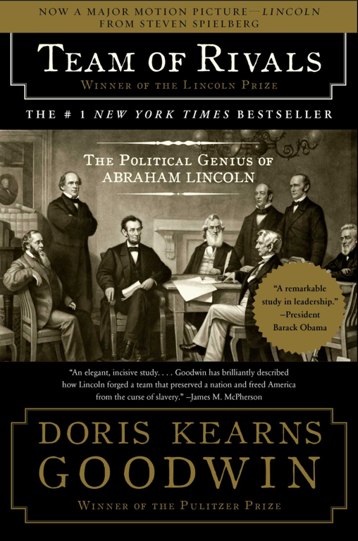

The years keep moving faster and faster, and this year there was lots of good food 
(see above photo of me eating concha in Mexico City), fun experiences, and some valuable lessons. 
As 2024 comes to an end, I thought it would be nice to look back on 5 things I learned.

# 1: The Value of exceptional emotional intelligence
This past year, I have been reading the incredible book 
[Team of Rivals](https://www.amazon.com/Team-Rivals-Political-Abraham-Lincoln/dp/0743270754) by Dorris Kearns Goodwin. 
It is a biography of President Abraham Lincoln and members of his cabinet 
(Seward, Chase, and Bates) before and during the civil war.

2 themes stuck out to me.

First, Lincoln experienced many serious defeats during his political career, in his personal life, and in the war. 
In spite of that, without fail, 
>"Lincoln withstood the storm of defeat by replacing anguish over an unchangeable past with hope in an uncharted future"

He had every reason to become negative, start to give up, but he didn't. 
He truly believed in his convictions and his purpose.

Second, he never took a political or personal attack personally. 
Even when members of his own party, cabinet, or inner circle went against him.
Goodwin sums it up well when she says: 
> "Discipline and keen insight had once again served Lincoln most effectively. 
> By regulating his emotions and resisting the impulse to strike back at chase ... 
> he gained time for his friends to mobilize the massive latent support for his candidacy."

Lincoln was able to stay level-headed in extreme situations by being extremely self-aware, and having constructive ways
to dispel anxiety Goodwin demonstrates in her book. It's not that he never felt nervous, angry, upset, or anxious, it's 
more that he was cognizant of these emotions he had and the emotions of others. He knew how to handle these emotions 
in healthy ways, which made him extremely successful in accomplishing his goals.

# 2: We do things because they are hard
This past year I have also been attempting to pick up wing foiling. Coming from a sailing background, 
I am always looking for water/wind activities, and after years of watching YouTube videos about wing foiling, my partner
finally convinced me to just buy a kit and try it.

If you are not familiar with it, I will include a picture below.

This is me:

This is what a pro looks like 😂:

I have been going to mission bay, and initially I couldn't even stand on the board without falling off.
Now I can taxi around using the handheld wing to go up and down wind.
It was extremely hard to even get to this point for me, but it feels nice when I see myself making progress.
Next step is to actually get on foil, and start flying above the water!
Hopefully in 2025 it happens!

# 3: The internet is not a valid "third place" (at least for me in the way I use it).
If you are not familiar with what a "[third place](https://en.wikipedia.org/wiki/Third_place)" is, it's like a 
place of social gathering other than home and work. It helps you connect with people in your community that are not
necessarily in your bubbles of industry, economic status, background.

In other words, this past year was kind of a wake-up call that in some ways, maybe a lot of ways, I am 
in a bubble. That doesn't necessarily mean my convictions need to change, but that I should be more wary of assuming that 
the majority of people think or have the same priorities as me. In fact, I should probably make zero assumptions 
about what others think, and should make a better effort to connect in valid third places to listen.

# 4: Diabetes Research is still advancing rapidly.
There were several interesting papers this year, most having genomics a key part of them.
This is probably a form of confirmation bias, but makes me feel good about my decision to pivot my career into
genomics, so that I can help play my small part of moving the ball forward.

Some of those interesting papers/videos included:

- Using Dexcom cgm data to identify 4 different sub phenotypes for type 2 diabetes: 
[Nature Paper](https://www.nature.com/articles/s41551-024-01311-6),
[My Bsky Post](https://bsky.app/profile/dddiaz.com/post/3leajsnt2gc2f)

- Glucose Sensing Insulin:
[Youtube Video](https://www.youtube.com/watch?v=lVTS_J7Xmxs),
[My Bsky Post](https://bsky.app/profile/dddiaz.com/post/3ldhfxf2bfk2c)

- 10 percent of people with #T1D do not have the DR3/DR4 haplotype, this paper investigates the genetic drivers for 
T1D in this population, and suggests the mechanism may be based more on inflammation and b-cell disfunction, rather than T-cell activation:
[Paper](https://diabetesjournals.org/care/article/doi/10.2337/dc24-1251/157547/Genetic-Discovery-and-Risk-Prediction-for-Type-1),
[My Bsky Post](https://bsky.app/profile/dddiaz.com/post/3ldevktg5qk25)

# 5: Eclipses are cool!
Especially when it's a total solar eclipse, and you are watching it with friends in Austin!
This photo does not do it justice, but it felt like staring into a black hole.

# Till next time
Thanks for reading. Let me know what you learned this year when you bump into me, I would love to hear it!

# Quote 
> "With public sentiment, nothing can fail, without it, nothing can succeed." - Abraham Lincoln
