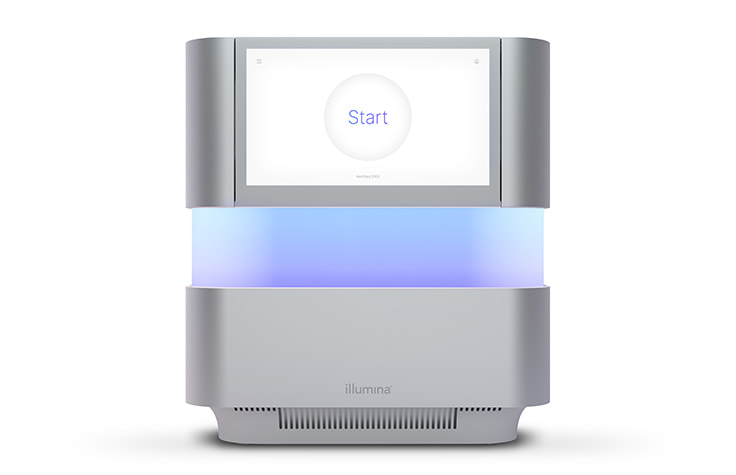
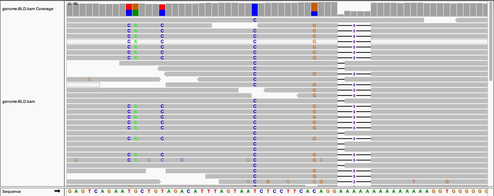
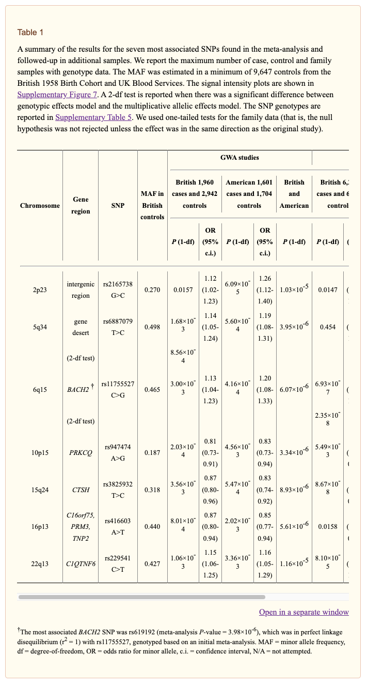

# 🥅 Goal: 
The Goal of this project is to analyze my own genome 🧬 to find Type 1 Diabetes Specific Variants.
Also hoping to learn some bioinformatics 🧑‍🔬 along the way.
I hope you will join me on this mini adventure. 🤠

# ⛱️ Background:

## What is a variant
If you think back to your High School Biology class, you probably remember learning about DNA. 
DNA is in every one of your cells, and it is part of what makes you, you. 
You can think of it like a blueprint. A blueprint that is only filled with the letters A, G, C, and T.
These are called Nucleotides. 
Sequences of nucleotides are translated by your cell into RNA. 
This RNA is then used to create every protein that your body needs to function.
This idea of DNA -> RNA -> Protein is commonly referred to as the Central Dogma of Biology.

Sometimes though, the letters change from what they are supposed to be, into something that they shouldn't.

For example, Sickle Cell Disease 🩸.
Sickle Cell Disease is a disease in which the red blood cells of the individual are not round shaped, but sickle shapped.
This disease can cause blood cells to stick together, and it is genetic in origin.
In people that have sickle cell disease, a single letter of their DNA is a T instead of an A.
This is called a Single Nucleotide Polymorphism, or SNP.

> Quick Aside:  
> To peak your curiosity even more, I have included the first part of the DNA sequence of the Coronavirus.  
> You can see the full sequence [here](https://www.ncbi.nlm.nih.gov/nuccore/NC_045512)  
>   
```Text
        Note: Technically viruses don't have DNA, 
        they just use RNA, but that's a topic for a different day.

        1 attaaaggtt tataccttcc caggtaacaa accaaccaac tttcgatctc ttgtagatct
       61 gttctctaaa cgaactttaa aatctgtgtg gctgtcactc ggctgcatgc ttagtgcact
      121 cacgcagtat aattaataac taattactgt cgttgacagg acacgagtaa ctcgtctatc
      181 ttctgcaggc tgcttacggt ttcgtccgtg ttgcagccga tcatcagcac atctaggttt
      241 cgtccgggtg tgaccgaaag gtaagatgga gagccttgtc cctggtttca acgagaaaac
      301 acacgtccaa ctcagtttgc ctgttttaca ggttcgcgac gtgctcgtac gtggctttgg

```

## What does Type 1 Diabetes have to do with genomics?

So here is the question, if a single letter variant in your genome can give you Sickle Cell Disease, can the same apply to Type 1 Diabetes.

Well, Yes and No.

First, if you are not caught up on what Type 1 Diabetes is, make sure to check out my [Blog Post](https://dddiaz.com/post/ndam2021/) where I explain my adventure with it.
The summary is, Type 1 Diabetes (which I often refer to as T1D) is an Autoimmune Disease of which we don't know the cause!

Current research suggest there are several hundred genes associated with a heightened risk of getting T1D, but there may be other factors at play as well.
Also, the variants associated with T1D are most likely not just single letters variants (the most simple kind of mutation), but can be several letters or hundreds of letters long, deleted letters, inserted letters, etc etc.
(There are many kinds of variants.)

The goal with this blog post, is to analyze some of the most strongly correlated single nucleotide variants (or polymorphisms) with Type 1 Diabetes, and see if my own genome exhibits those variants.

# 🧬 Getting the Data
Ok, so this seems very cool, but how do I actually obtain my Genome Sequence and the associated variants?

I am fortunate enough to actually work for a genome sequencing company which allows us to get our genome sequenced. 
This is technically available to anyone, but because of some special circumstances it was free for me 🥂 (Definitely a cool perk).
I was asked to submit a blood sample, which would then be sequenced.
Now, you may have heard of services like 23andMe or Ancestry that also attempt to analyze your genome, but those tests only cover portions of your genome that are associated with interesting traits like enjoying coffee.
In my case, I was going to get my entire genome sequenced converting that blood sample into the full text file of As Gs Ts and Cs that make up my DNA.

## Sequencing
This is what a DNA Sequencer Looks Like:


These sequencers blow up your dna into millions of small segments, then gradually rebuild each segment. 
While it rebuilds each segment, it attaches a letter to the DNA's mirror image one by one, and that letter is special in that it is designed to emit a light. 
Green for the letter A, Red for the letter G, and so on.
The sequencer sees these flashes of light, converts them to letters, then works to assemble all of these small segments of dna back together.
It's honestly kind of magic.

For a full video explanation check out this [youtube video](https://www.youtube.com/watch?v=fCd6B5HRaZ8) 

The output of this process is something called a BAM file.

Now simply having the full genome sequence is cool, but it is not the goal. 

The next step is to "Call Variants".


For this we use something called Dragen (Pretty cool side note, I help work on this! 😊 ).
This will look at your DNA Sequence, and determine where it thinks there are variants.
It uses a bunch of very fancy Bioinformatics Algorithms, FPGA Tech, and even some Machine Learning.
This will output a file of every variant it thinks is in your DNA called a VCF File (or Variant Call Format File).

At this point, we have sequenced my DNA, called variants on that DNA, and stored the results.

Now comes the fun part, I need to download this data ✨!
I was provided a link to download my data from BaseSpace, but check out the size!

That is over 70GB for a single genome 🤯!

# 🖥️ Displaying the data
Now that I have all the files representing my genome, lets load it into IGV. IGV is a tool that lets you see the letters of the genome, and how they were read by the sequencer.

The colorful letters at the bottom are the reference genome, and the columns of letters are places where I have a variant between my genome and the reference!
Very Cool!

# 🧑‍🔬 Finding Research about T1D Variants
OK, So I have the data, and I can see my DNA!

But now I need to find a list of single nucleotide polymorphisms that are worth checking.
I went over to NCBI and just started searching.
I found this paper, which seemed somewhat promising.
[Meta-analysis of genome-wide association study data identifies additional type 1 diabetes loci](https://www.ncbi.nlm.nih.gov/pmc/articles/PMC2635556/)

In that paper they have a table of the seven most associated SNPs or single nucleotide polymorphisms (aka Variants!).
[Direct Link to table](https://www.ncbi.nlm.nih.gov/pmc/articles/PMC2635556/table/T1/?report=objectonly)


OK, so now I have a list of SNPs I can cross-check against, lets take a look at my own VCF.

# ⭐ Analyzing my VCF

```python
# SNPs of interest
# 7 most associated genes from this paper for Type 1 Diabetes
# Paper: https://www.ncbi.nlm.nih.gov/pmc/articles/PMC2635556/
# Table: https://www.ncbi.nlm.nih.gov/pmc/articles/PMC2635556/table/T1/?report=objectonly#TFN1
t1d_variants = ["rs2165738", "rs6887079", "rs11755527", "rs947474", "rs3825932", "rs416603", "rs229541"]

with open('data.vcf') as vcf_uncompressed_file:
    print("#CHROM	POS	ID	REF	ALT	QUAL	FILTER	INFO	FORMAT")
    for line in vcf_uncompressed_file:
        if any(variant in line for variant in t1d_variants):
            print(line)
```

This python code snippet reads in the VCF and outputs lines where it found a variant I was interested in.

Let's take a look at one of the variants:

| CHROM                                                      | POS                                                      | ID                                              | REF                                   | ALT                                 | QUAL                              | FILTER                 | INFO | FORMAT                               |
|------------------------------------------------------------|----------------------------------------------------------|-------------------------------------------------|---------------------------------------|-------------------------------------|-----------------------------------|------------------------|--|--------------------------------------|
| 2	| 24692809	| rs2165738	| C	| G	| 584.0	PASS	| SNVHPOL=4;MQ=60;GMAF=C 0.4267;AA=C;AF1000G=0.573283;phyloP=0.085	| 1/1 | - |

In the case above, on Chromosome 2 at position 24692809 I have a G when the reference genome (AKA the genome we are comparing against) has a C.

The row also calls out the variant ID we were looking for earlier "rs2165738"

Now this is where there are some gaps in my knowledge. There is some metadata about this variant at the end of the row that I don't have a full understanding of, so I have some homework on my side.

# 🔥 Results

I seem to have some variants listed in the list of interesting variants associated with Type 1 Diabetes.  

This actually does not align with the results I expected.
The reason being is that I spoke with a genetic counselor who analyzed my genome and informed me I had none of the known Type 1 Diabetes Variants.

This might be because the variants I see are not significant, and the counselor thought they were worth ignoring.
It also might be because the variants I am using are new, and were not used by the counselor.

Seems like I have more to do to understand when variants become significant and actionable.

# 📖 What I Learned
- I have some variants from the paper I found on NCBI! But to be clear, having a variant from that paper doesn't automatically mean you would get T1D.
- VCF's are cool, and I need to learn more about some of the meta-data fields to better understand them.  
- The reference genome is also still very weird to me. It is derived from 13 anonymous volunteers from Buffalo, New York, which doesn't seem like a very diverse dataset with over 7 billion people in the world. The good news is, there seems to be some work in this area with the 1000 genomes project to create a more diverse reference genome.

# 🆒 Why this is cool
Type 1 Diabetes is an extremely complex disease with new associated variants being discovered every year.
UCSD just published a [paper](https://www.universityofcalifornia.edu/news/cellular-culprit-type-1-diabetes) where they performed the largest ever genome wide association study and identified 69 new association signals! 
By analyzing the genomes of thousands of people, and overlapping all their associated mutations, they were able to correlate certain mutations with disease.
The hope is one day, once we understand all the variants associated with T1D, we can predict who will get Type 1 Diabetes, and administer treatments to prevent or delay onset.  

> That is also what makes me so excited to work at Illumina. I know the technology I work on will help  people in my community with genetic diseases, and hopefully one day, people just like me.

# 🚀 What's Next
MOAR Genome Variant Analysis! Stay Tuned.

#### P.S. Variant, but not like Loki Variants 🤣

